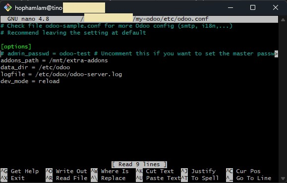
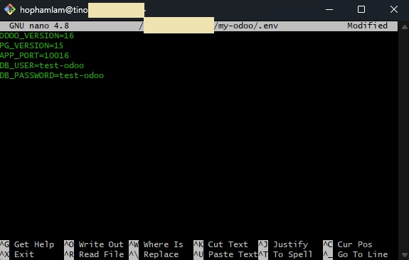

# hophamlam/my-odoo

This Odoo repo is built from [minhng92/odoo-13-docker-compose](https://github.com/minhng92/odoo-13-docker-compose) and include some of my features:

- Multi version 
- `.env` with custom variables
- `CI/CD` using `Github Actions`
- `Development` and `production` ready

That's it, let's take a look!


# Prerequisites
- Recommended OS: Linux Ubuntu 20.04 LTS with at least 2GB RAM.
- Have basic understanding [Odoo](https://www.odoo.com/).
- [Docker](https://www.docker.com/) and [Docker-compose](https://docs.docker.com/compose/) installed (Check [my repo](https://github.com/hophamlam/initial-server) for initial server).

# First time setup

This will execute `sudo nano ~/my-odoo/.env` and bring you to `nano editor`, input yours or check my `.env`. 

```bash
sudo git clone https://github.com/hophamlam/my-odoo.git && sudo chmod -R 777 ~/my-odoo/addons && sudo chmod -R 777 ~/my-odoo/etc && sudo mkdir -p ~/my-odoo/postgresql && sudo chmod -R 777 ~/my-odoo/postgresql && sudo nano ~/my-odoo/etc/odoo.conf && sudo nano ~/my-odoo/.env && sudo docker-compose -f ~/my-odoo/docker-compose.yml up 
```

This is an example of my `.env`

```conf
ODOO_VERSION=16
PG_VERSION=15
APP_PORT=10016
DB_USER=test-odoo
DB_PASSWORD=test-odoo
```

It will ask for editing `odoo.conf`, leave it default if you're not experienced. You can set master password on your own or leave it commented (a auto-generated will be provided)





Check `localhost:10016` or the port you choose


Restart `Odoo containers stack`

```bash
sudo docker-compose -f ~/my-odoo/docker-compose.yml up --build --force-recreate -d
```

Edit `.env` variables

```bash
sudo nano ~/my-odoo/.env
```

Remove all `Odoo containers stack` and the whole directory `my-odoo`

```
sudo docker-compose -f ~/my-odoo/docker-compose.yml down
sudo rm -rf ~/my-odoo
```

# For production

Modify `GIthub Actions` workflows for your pipeline, mine is a very basic one.

This setup is tested with just few instances for less-than-10-user project (development, staging, production ci/cd with very low effort) and with not-so-busy activities. Should be carefully test if you use it as massive services (k8s, multi-workers, load balancing)